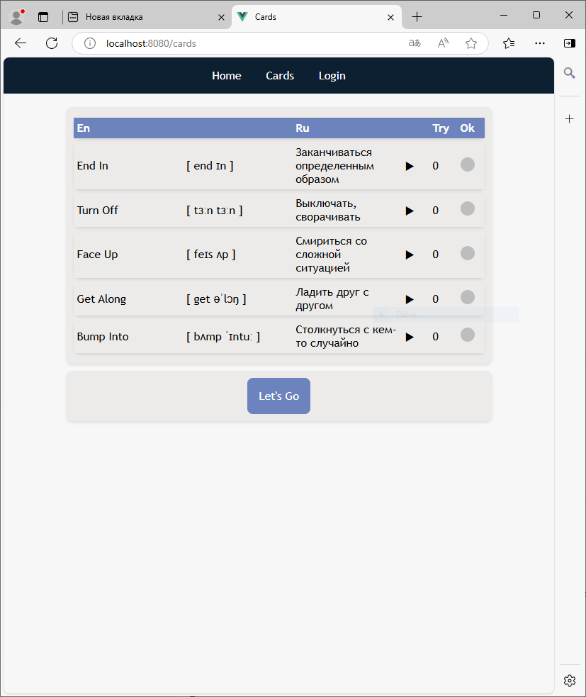
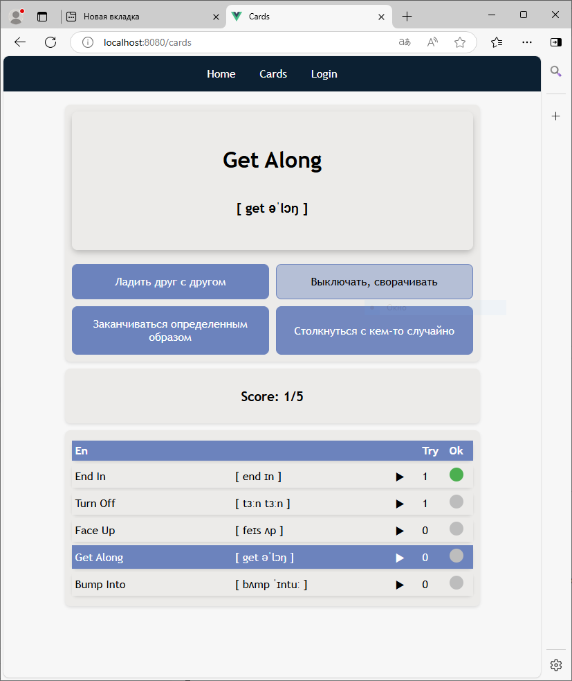
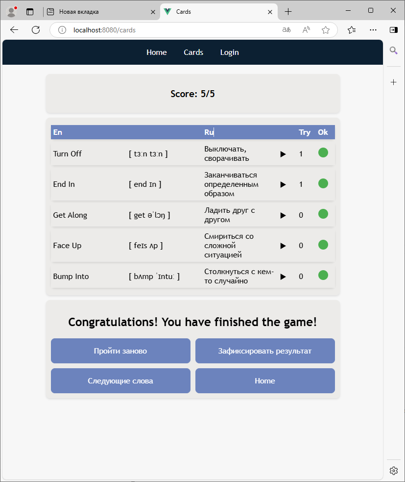

  

# Тренажер для изучения английского языка.

1. Загружаем новые слова из БД 

2. Учим 

3. Фиксируем результат в БД 

## Общee описание:
Есть словарь с английскими словами, транскрипцией, переводом и примерами использования.
Пользователь выбирает группу слов, которую хочет изучить. И загружает ее в тренажер. 
Тренажер представляет собой карточку с английским словом, транскрипцией, функцией воспроизводства аудио и четырьмя вариантами ответа. Как только все карточки со словами выбраны верно, можно зафиксировать результат по изученным словам в БД. 
Фиксация нужна для ведения статистики по прогрессу пользователя. Можно посмотреть сколько слов изучено, выбрать для повторения слова с наихудшими показателями,...

## Проект в стадии разработки... 

## Revision
- 1: Загрузка исходного кода проекта.

Сделана только основа(работа с БД, вывод шаблонов html, базовая механика тренажера, логирование пользователей)
   

## Authors:
@PolinaSvet
**!!! It is for test now !!!**
